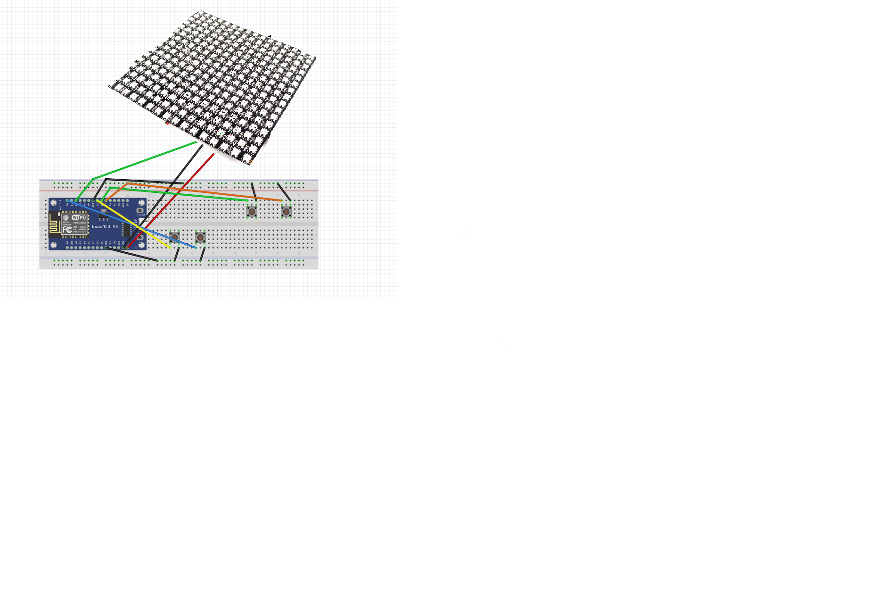
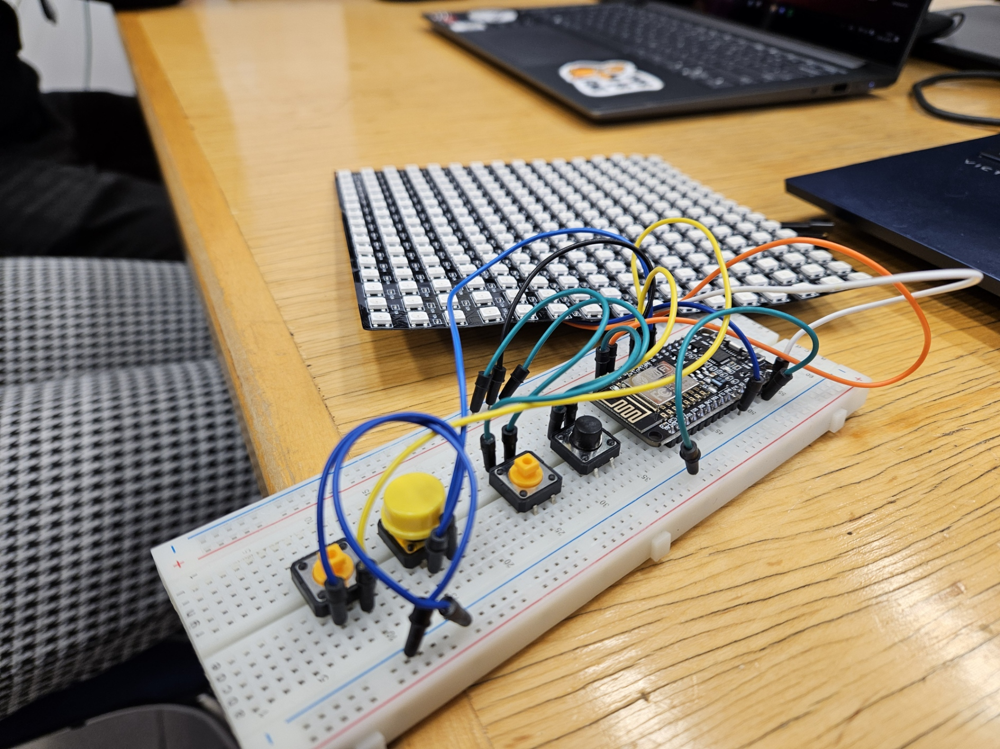
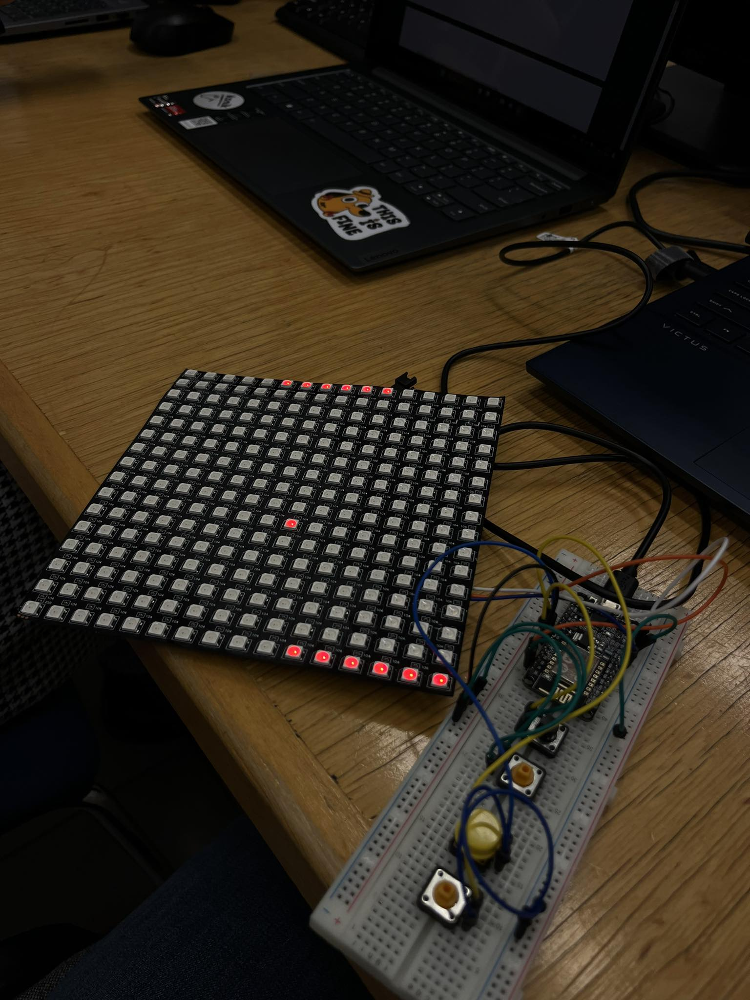
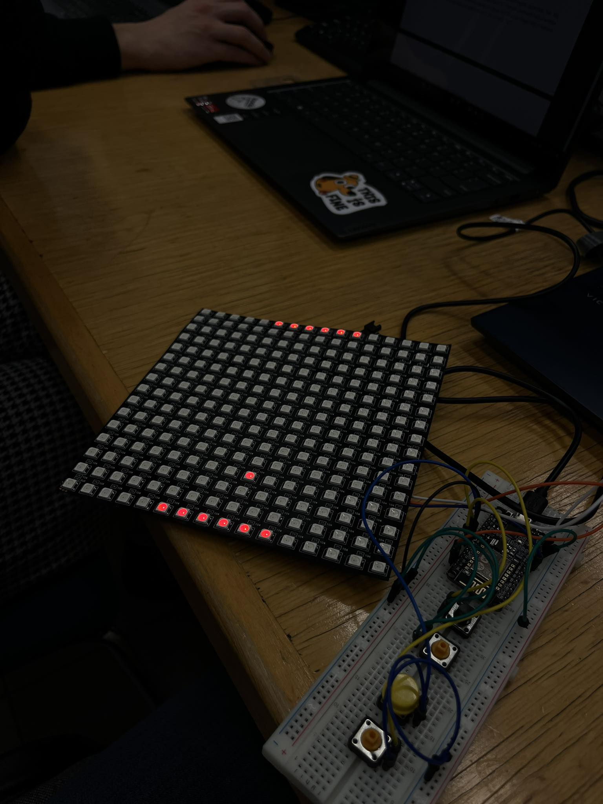
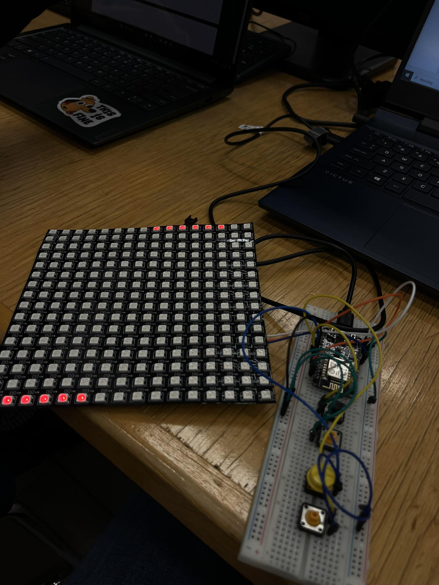

# Pong
Game Pong on Led matrix 16x16 using ESP8266

## Table of contents
* [General info](#general-info)
* [Components](#components)
* [Project description](#project-description)
* [Diagram](#diagram)
* [Images](#images)

## General info
As part of this project, a Pong game has been implemented for 1v1 gameplay on a flexible LED matrix with dimensions of 16x16 pixels. Currently, players control paddles using two buttons, moving up and down.
	
## Components
Project is created with:
* ESP8266 board
* Flexible 16x16 matrix - 256 RGB LEDs - WS2812B
* 4 buttons

## Project description
"The project involves creating a Pong game where players compete on a flexible 16x16 LED matrix. The ESP8266 microcontroller, installed with MicroPython interpreter, serves as the central control unit. The game is designed for 1v1 gameplay, where each player controls their paddle using two buttons.

Game features:
* Paddle control: Players use two buttons to move their paddles up and down, controlling the ball's rebound.
* Ball trajectory: The ball changes its trajectory depending on the point of impact on the paddle, adding a tactical element to the gameplay.
* Ball acceleration: The ball speeds up with each rebound, increasing the game pace and making it more challenging for players.
* Configurable parameters: Paddle width, paddle movement speed, and ball speed are easily configurable, allowing customization according to player preferences.

Expansion possibilities:
* Scoring and display: Adding scoring functionality and displaying players' scores.
* User interactions: The ability to adjust various parameters before starting the game, such as paddle color or movement speed, to cater to individual preferences.
* Graphic enhancements: Adding visual effects, animations, or other interactive elements to enhance the game's visual appeal."

## Diagram

## Images

